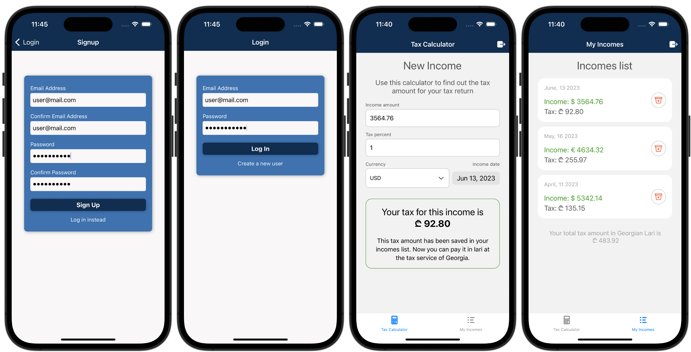

## React Native Income Tax App
### Mobile application with Firebase authentication and Firebase store. 

The application allows to calculate the monthly income in Georgia using the public API of the National Bank of Georgia.
To find out the tax rate, set the income amount value, income date, desired currency and tax percentage to get the monthly income amount and save it in the Firebase store for your account.
In the income list, you can view all your income records.

